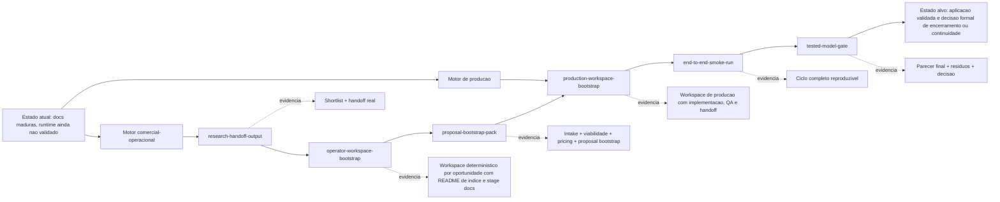

# Mission Compass

Este documento define a direcao do sistema como uma microempresa operacional com dois motores: um fecha trabalho e outro produz o servico/produto vendido.
Seu papel e mostrar de onde estamos saindo, para onde queremos chegar e quais checkpoints mantem o rumo sem criar burocracia desnecessaria.

## Onde Estamos

Hoje o projeto esta neste ponto:

- a documentacao operacional esta madura o suficiente para guiar a execucao
- o fluxo de research ja existe como entrada real do sistema
- o fluxo de proposta, kickoff, delivery e handoff esta descrito
- a execucao ainda nao foi validada em um ciclo real completo
- o `modelo testado` ainda nao existe como evidencia formal

Em termos praticos:

- o sistema sabe o que fazer
- o sistema ainda precisa provar que faz isso de ponta a ponta

## Onde Queremos Chegar

O destino final nao e "mais documentos".

O destino e uma aplicacao validada, com estas caracteristicas:

- uma oportunidade real entra pelo research
- um workspace operacional nasce a partir dessa oportunidade
- a proposta e o pacote de entrega sao bootstrapados sem reinterpretaçao manual
- o serviço/produto vendido vira um workspace de producao acionavel dentro de um ambiente de execucao
- um smoke run end-to-end prova que o fluxo funciona
- o gate final decide, por evidencia, se o modelo pode ser marcado como testado

## Visao Macro

## Checkpoints

Cada checkpoint precisa responder uma pergunta objetiva.

| Checkpoint | Pergunta | Evidencia minima | Decisao |
| --- | --- | --- | --- |
| `research-handoff-output` | A pesquisa virou entrada operavel? | shortlist e handoff reutilizavel | seguir ou corrigir a base |
| `operator-workspace-bootstrap` | Existe um workspace claro por oportunidade? | README de indice + intake, viabilidade e pricing em arquivos separados | seguir ou ajustar a organizacao |
| `proposal-bootstrap-pack` | O salto para proposta ficou curto? | intake, viabilidade, pricing e proposta inicial | seguir ou refinar o pack |
| `production-workspace-bootstrap` | O que foi vendido virou producao acionavel? | ambiente, dependencias e checkpoints de entrega | seguir ou corrigir a ponte para delivery |
| `end-to-end-smoke-run` | O fluxo completo funciona de fato? | um ciclo real executado e registrado | seguir ou corrigir o gargalo |
| `tested-model-gate` | Ja ha evidencia suficiente para encerrar o loop? | parecer final com residuos e criterio de saida | marcar `modelTested` ou continuar |

## Regras De Controle

O controle e profissional, mas leve:

- cada checkpoint produz um artefato verificavel
- cada checkpoint pode abrir um cleanup curto
- cada cleanup remove ruido, duplicacao e ambiguidade
- cada decisao precisa deixar rastro escrito
- nenhuma nova frente lateral deve abrir antes do gargalo principal fechar
- documentacao e producao podem rodar em paralelo quando o contrato do artefato estiver congelado
- o paralelismo deve parar no primeiro checkpoint curto se houver deriva entre contrato e execucao

## Dois Motores

O sistema opera com dois motores acoplados:

- motor comercial-operacional: pesquisa, qualifica, precifica e fecha
- motor de producao: cria o ambiente, implementa o servico/produto vendido, testa e prepara o handoff

O segundo motor nao e opcional. Sem ele, o sistema vira apenas um administrativo com boa orquestracao.

## Cleanups Permitidos

Use cleanups para manter o sistema limpo sem travar a execucao:

- remover links mortos ou duplicados
- alinhar nomenclatura entre docs, scripts e fila
- consolidar instrucoes repetidas
- registrar riscos residuais
- simplificar qualquer etapa que nao aumente evidencia

## Regra De Parada

O ciclo termina quando uma destas condicoes ocorrer:

- `automation/antigravity-goal.json` tem `modelTested: true`
- `automation/antigravity-goal.json` tem `stopRequested: true`
- o usuario manda parar

## Regra De Ouro

Nao confundir controle com rigidez.

O sistema precisa de checkpoints, organizacao e verificacoes de rumo.
Ele nao precisa de burocracia que atrase a prova real.
